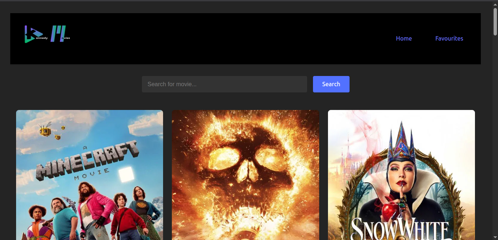

# Movie Discovery

Movie Discovery is a modern React application that allows users to browse, search, and favorite movies using data from The Movie Database (TMDb) API. The app features a responsive UI, persistent favorites, and a seamless user experience.

---

## Features

- **Browse Popular Movies:** View a list of trending movies fetched from TMDb.
- **Search:** Instantly search for movies by title.
- **Favorites:** Add or remove movies from your favorites list, which is saved in your browser.
- **Responsive Design:** Works well on both desktop and mobile devices.
- **Persistent Storage:** Favorites are stored in localStorage for persistence across sessions.

---

## Screenshots



---

## Getting Started

### Prerequisites

- [Node.js](https://nodejs.org/) (v16 or higher recommended)
- [npm](https://www.npmjs.com/) (comes with Node.js)

### Installation

1. **Clone the repository:**
   ```sh
   git clone https://github.com/fannul/movie-discovery.git
   cd movie-discovery
   ```

2. **Install dependencies:**
   ```sh
   npm install
   ```

3. **Set up environment variables:**
   - Copy `.env.example` to `.env` and add your TMDb API key:
     ```
     VITE_TMDB_API_KEY=your_tmdb_api_key_here
     ```

### Running the App

- **Development mode:**
  ```sh
  npm run dev
  ```

- **Production build:**
  ```sh
  npm run build
  ```

- **Preview production build:**
  ```sh
  npm run preview
  ```

---

## Project Structure

```
movie-discovery/
  ├── public/
  ├── src/
  │   ├── assets/
  │   ├── components/
  │   ├── contexts/
  │   ├── css/
  │   ├── pages/
  │   ├── services/
  │   ├── App.jsx
  │   ├── main.jsx
  │   └── index.css
  ├── .env
  ├── package.json
  ├── vite.config.js
  └── README.md
```

---

## Technologies Used

- [React](https://react.dev/)
- [Vite](https://vitejs.dev/)
- [TMDb API](https://www.themoviedb.org/documentation/api)
- [React Router](https://reactrouter.com/)
- [React Icons](https://react-icons.github.io/react-icons/)

---

## Contributing

Contributions are welcome! Please open an issue or submit a pull request for any improvements or bug fixes.

---

## License

This project is licensed under the [MIT License](LICENSE).

---

## Acknowledgements

- [TMDb](https://www.themoviedb.org/) for the movie data API.
- [Vite](https://vitejs.dev/) for fast React development tooling.

---