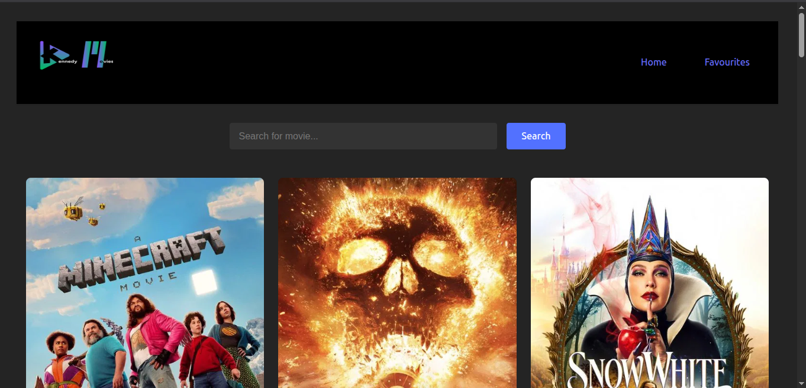

# React + Vite

# Movie Discovery

Movie Discovery is a modern React application that allows users to browse, search, and favorite movies using data from The Movie Database (TMDb) API. The app features a responsive UI, persistent favorites, and a seamless user experience.

## Features

- **Browse Popular Movies:** View a list of trending movies fetched from TMDb.
- **Search:** Instantly search for movies by title.
- **Favorites:** Add or remove movies from your favorites list, which is saved in your browser.
- **Responsive Design:** Works well on both desktop and mobile devices.
- **Persistent Storage:** Favorites are stored in localStorage for persistence across sessions.

## Screenshots



## Getting Started

### Prerequisites

- [Node.js](https://nodejs.org/) (v16 or higher recommended)
- [npm](https://www.npmjs.com/) (comes with Node.js)

### Installation

1. **Clone the repository:**
   ```sh
   git clone https://github.com/fannul/movie-discovery.git
   cd movie-discovery